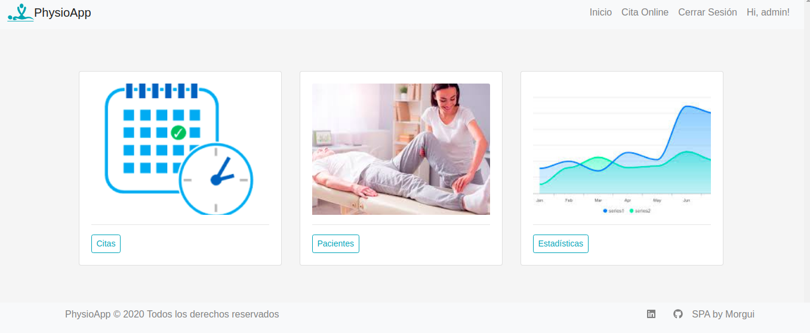

# PhysioApp

PhysioApp es el proyecto final que realicé en el [bootcamp de Full Stack Web Dev en Ironhack](https://www.ironhack.com/es/desarrollo-web). Después de completar nuestra formación en React, Node, Javascript,..., tuvimos dos semanas para desarrollar una Single Page Aplication. 

### Funcionamiento

Se trata de una aplicación para la gestión de negocio de fisioterapia, donde los clientes pueden pedir cita y el profesional puede gestionar dichas citas y llevar un control sobre estas, además de poder gestionar los expedientes y tener un control sobre las estadísticas de las citas canceladas y realizadas en el último mes.

### Realizado con

Este proyecto ha sido realizado con React, Node, Express y MongoDB.